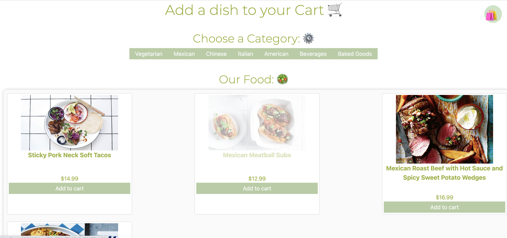
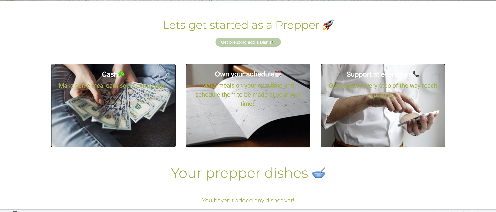

# At your door step
  
  

    ## Table of Contents
  - [Description](#description)
  - [Images](#images)
  - [intallation instructions](#intallation)
  - [usage information](#usage)
  - [contribution guidelines](#contribution)
  - [test instructions](#test)
  - [Questions](#Questions)
  - [License](#License)

    ## Description
    This project is a website for a home delivery service for people to order home cooked meals for the week. Minimizing cooking costs and saving food. As a custmer you are able to browers though the meals that are preps have created add them to your cart and pay for them via stripe. Our prepper will we notified and you will be given a time frame when they will devliver your home cooked meal for you. 

      ## Images 
       
        
        

    ## intallation 
    ADD LINK TO PROJECT HERE

    ## usage 

    The application is used as a way for discovering culunary  talent in your local town or neighborhood. And ordering on our website to try out on your own.

    ## contribution

    to contribute create a pull request

    ## test 

    jest test will be implmented in the future

    ## Questions

    Contact Me At:

    [jesse@gmail.com:](jesse@gmail.com);

    Git Hub:
    [Jmaun22:](https://github.com/Jmaun22)

    just email plz

    ## License
    MIT
  
    
    MIT License

    Copyright (c) [2022] [Jesse M]
    
    Permission is hereby granted, free of charge, to any person obtaining a copy
    of this software and associated documentation files (the "Software"), to deal
    in the Software without restriction, including without limitation the rights
    to use, copy, modify, merge, publish, distribute, sublicense, and/or sell
    copies of the Software, and to permit persons to whom the Software is
    furnished to do so, subject to the following conditions:
    
    The above copyright notice and this permission notice shall be included in all
    copies or substantial portions of the Software.
    
    THE SOFTWARE IS PROVIDED "AS IS", WITHOUT WARRANTY OF ANY KIND, EXPRESS OR
    IMPLIED, INCLUDING BUT NOT LIMITED TO THE WARRANTIES OF MERCHANTABILITY,
    FITNESS FOR A PARTICULAR PURPOSE AND NONINFRINGEMENT. IN NO EVENT SHALL THE
    AUTHORS OR COPYRIGHT HOLDERS BE LIABLE FOR ANY CLAIM, DAMAGES OR OTHER
    LIABILITY, WHETHER IN AN ACTION OF CONTRACT, TORT OR OTHERWISE, ARISING FROM,
    OUT OF OR IN CONNECTION WITH THE SOFTWARE OR THE USE OR OTHER DEALINGS IN THE
    SOFTWARE.

    (MIT)[https://choosealicense.com/licenses/mit/]
    

   

  
  